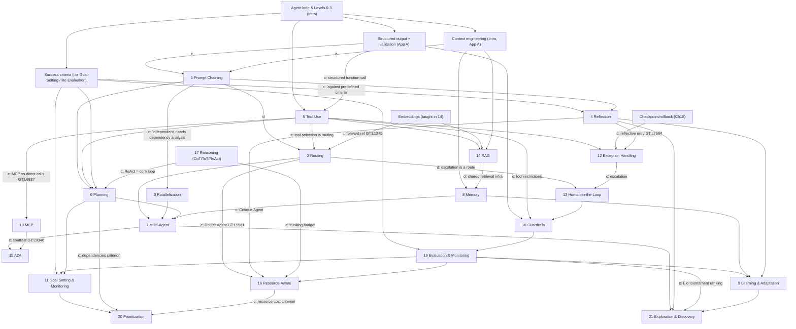

# Agent Academy — Design Analysis (first deliverable, no code)

Status: design analysis for review. Nothing here has been built or play-tested. Every
threshold, mission parameter and schema field is a proposal.

Companion file: [`PROVENANCE-AUDIT.md`](PROVENANCE-AUDIT.md) (full artifact-by-artifact audit,
notebook weakness list, citation index).

---

## 0. Evidence contract used in this document

### 0.1 Labels

Every substantive claim carries one of these labels. The labels are the point of the
document; please read them before reading the answers.

| Label | Meaning | May be taught as |
| --- | --- | --- |
| **[C]** | CANONICAL. Stated in the book text. Cited as `GT:L<line>` (and PDF page where useful). | Author's claim. Still not necessarily *true*; it is what the source says. |
| **[C-nb]** | CANONICAL-NOTEBOOK. Code or text in `chapter_notebooks/*.ipynb`. The notebooks were never diffed against the book's code blocks, and almost none were executed. | "What the book's companion code does", with status badge. |
| **[W]** | WEAK / DAMAGED. A canonical example that is broken, a stub, non-parsing, misfiled, or demonstrates the weaker variant of its own pattern. | Counterexample or "repair this" exercise only. Never as a positive model. |
| **[D]** | DERIVED. Our architectural interpretation, the academy's ontology, framing, fiction, mechanics, thresholds, and the prior skill library (`skills/`, `manifest.json`, `models/`, role mapping). | "Academy model" — visibly labelled as ours. |
| **[U]** | UNCERTAIN. Evidence is ambiguous, time-sensitive, or unverified. | Only with the uncertainty shown. |
| **[X]** | NONEXISTENT. An artifact named in the directive that does not exist anywhere in the repository. | Nothing. Its contents are not invented here. |

### 0.2 Sources and the commits used

- **Book text.** `ground-truth/agentic_design_patterns.txt` (added in commit `92334d7`, merged to `origin/main` at `ed9027e`). `cmp` shows it is **byte-identical** to the user's upload `agentic_design_patterns_ec92.txt` (882,642 bytes, 17,658 lines). It is `pdftotext -layout` output of the repository PDF (458 pages per `pdfinfo`, recorded by the audit branch). PDF page numbers below come from form-feed page breaks in that text.
- **Newest commit.** `ed7e205` on `origin/cursor/repo-evidence-audit-1033` (2026-09-23), whose parent is `origin/main` = `ed9027e` (2026-09-21). Both are **newer than `10ad49a`**, the base of this branch. Following "newest commits win", `ed7e205` is the authoritative state for the README, the validator, and the only validation records (`validation/audit/`). For book content, `ed9027e`/`ed7e205` add no changes beyond the ground-truth text.
- **Branch caveat.** As instructed, this document's branch (`cursor/agent-academy-design-eada`) was cut from `10ad49a`. The newer files it cites (`ground-truth/`, `validation/audit/`) **are not present on this branch**. Read them with `git show ed7e205:<path>`. The coordinator should either merge `origin/main` + `ed7e205` before this lands, or rebase this doc onto them.
- **Other branches.** `cursor/agent-skill-library-b24b`, `skill-library-6dc8`, `skill-library-7680` and `agentic-skill-library-3108` are older (2026-09-20) parallel attempts at the skill library, superseded by the `eada` merge (`fede537` on main). None contains any directive-named artifact (§1.2).

### 0.3 What was verified directly versus taken from the audit branch

Verified directly for this document: `cmp` of the book text; chapter and appendix locations; every `GT:L` quote cited below; the notebook syntax, stored-error, deprecated-API, and placeholder scan; semantic reading of the Ch 2 (OpenRouter), 9, 11, 12, 13, 16, 19, 20 and 21 notebooks; running the validator at `10ad49a` (27 pass / 1 fail); a grep of our skill deep-dives against the book.

Taken from `ed7e205:validation/audit/` and **not** independently re-run here: the `pdfinfo` page count, the 17-line Poppler delta, the validator result at `ed7e205` (26 pass / 2 fail), and the security findings (Colab user ids in notebook metadata).

---

## Table of contents

- [0. Evidence contract](#0-evidence-contract-used-in-this-document)
- [1. Source contract findings](#1-source-contract-findings)
  - 1.1 Corpus inventory · 1.2 Directive-named artifacts (exist / do not exist) · 1.3 The complete pattern inventory (21 chapters **plus** what the intro, appendices and chapter bodies add)
- **Part II — the fifteen questions**
  - [Q1 Graduation understanding](#q1-what-should-the-learner-understand-when-graduating)
  - [Q2 Conceptual dependencies](#q2-conceptual-dependencies-among-all-patterns)
  - [Q3 Teaching order](#q3-teaching-order-and-why)
  - [Q4 Ontology](#q4-ontology--which-dimensions-each-pattern-occupies)
  - [Q5 Mechanics](#q5-concepts-that-should-become-game-mechanics)
  - [Q6 Simulations](#q6-concepts-that-require-simulations)
  - [Q7 Engineered failures](#q7-failures-to-engineer-intentionally)
  - [Q8 What the player sees](#q8-what-information-the-player-should-see)
  - [Q9 Hidden then revealed](#q9-what-is-hidden-and-progressively-revealed)
  - [Q10 Difficulty](#q10-how-difficulty-should-increase)
  - [Q11 First ten missions](#q11-the-first-ten-missions)
  - [Q12 Graduation simulation](#q12-graduation-simulation)
  - [Q13 Insufficiently validated](#q13-parts-of-the-corpus-insufficiently-validated-to-teach-as-canonical)
  - [Q14 Derived theory](#q14-our-derived-architectural-theory-not-the-source)
  - [Q15 Instrumentation and trace schema](#q15-instrumentation-for-future-evaluation-evidence)
- **Part III — extra asks**
  - [16 Contradictions](#16-contradictions)
  - [17 Missing prerequisites](#17-missing-prerequisites)
  - [18 Weak examples](#18-weak-examples)
  - [19 Where the academy can teach better than the source](#19-where-the-academy-can-teach-better-than-the-source)
  - [20 Assumptions we tried to falsify](#20-assumptions-we-tried-to-falsify)
- **Part IV — architecture**
  - [21 Browser information architecture](#21-browser-information-architecture)
  - [22 Curriculum architecture](#22-curriculum-architecture)
  - [23 Limitations of this analysis](#23-limitations-of-this-analysis)

---

## 1. Source contract findings

### 1.1 Corpus inventory (at `ed7e205`)

| Item | What it is | Class |
| --- | --- | --- |
| `Agentic_Design_Patterns_Complete.pdf` | The book. Unmodified since `7ddebbc`. | [C] |
| `ground-truth/agentic_design_patterns.txt` | Layout text of the PDF. Identical to the user's upload. | [C] (extract) |
| `chapter_notebooks/Chapter_*.ipynb` (56) | Code snippets per chapter. Counts per chapter, 1→21: 2,3,2,3,5,2,6,5,1,5,1,1,1,3,3,2,4,3,2,1,1. | [C-nb], with many [W] (§18) |
| `chapter_notebooks/Appendix_*.ipynb` (9) | 7 are Google-Drive placeholders that raise `NameError`. `Appendix_C_(Code)` has stored `NameError` outputs. `Appendix_Pydantic` needs `pydantic`. | [W] / historical |
| `chapter_notebooks/*.SKILL.md` (56) | Byte copies of our skill cards. | [D], duplicate |
| `skills/<id>/…` (21 × 4 files), `manifest.json`, `AGENTS.md`, `models/*.md` | The skill library we wrote. | [D] |
| `tools/validate.py` | Structure and token checks, plus a run of the 21 offline stubs. | [D] tooling |
| `validation/audit/*` (on `ed7e205` only) | Repository evidence audit: evidence map, correction log, notebook inventory, consistency report, unresolved items. | [D] — the only validation records in the repo |

### 1.2 Directive-named artifacts: which exist

I searched every remote ref with `git grep` (excluding PDF and ipynb), the commit messages, and the file names.

| Directive term | Status | Nearest real thing |
| --- | --- | --- |
| canonical pattern records | **Partially exists** (under another name) | `manifest.json` records and `skills/*/SKILL.md`. These are **[D]** summaries, not canonical records. Nothing in the repo is a canonical per-pattern record extracted from the book with citations. |
| code-pattern records | **Partially exists** | `skills/*/references/deep-dive.md` and `patterns.md` [D]. They mix book code with invented code and carry no provenance markers (§18, W-15). |
| ROUTING-INDEX | **[X] does not exist** | `AGENTS.md` "Role -> Skills" table [D] is the only routing-like index. |
| EVALUATION-LAYER-MODEL | **[X] does not exist** | none |
| MANIFEST | **Exists** as `manifest.json` [D] | — |
| validation records | **Exists only on `ed7e205`**: `validation/audit/` | Plus `tools/validate.py` output. |
| conversion findings | **[X]** as a named artifact | `validation/audit/03-documentation-accuracy.md` and `04-correction-log.md` are the closest. |
| contradictions | **[X]** as a named artifact | `validation/audit/09-consistency-report.md` (repo-internal consistency only, not book contradictions). §16 below is the first book/notebook/library/directive contradiction register. |
| extraction findings | **[X]** | `ground-truth/README.md` and the audit's evidence map on the extract. |
| failed routing fixtures | **[X] does not exist** | No fixtures of any kind exist. There are no tests beyond `validate.py`. |
| schema history | **[X] does not exist** | Only git history of `manifest.json`. |

**Consequence.** The directive's phrase "our validated Agentic Design Patterns corpus" is not supported. The only validation that exists is structural (files present, token counts) plus a repo-accuracy audit. No pattern claim has been validated against the book except where this document or the audit cites a line. At `ed7e205` the validator itself fails 2 of 28 checks (the 3,000-token budget: 3,006 and 3,014), per `ed7e205:validation/audit/09-consistency-report.md`. At `10ad49a` it fails 1 of 28, only because `origin/main` gained `ground-truth/`. "Validated" status is branch-dependent.

### 1.3 The complete pattern inventory: what the whole corpus contains beyond the 21 chapters

The directive says to "let the complete corpus determine the ontology". The 21-skill library covers only the 21 chapter titles. The book contains more pattern-grade material than that, in the introduction, the appendices, and sections inside chapters.

| # | Pattern / concept | Where (all [C]) | In our library? | Academy use |
| --- | --- | --- | --- | --- |
| E1 | **Agent complexity levels 0–3** (core reasoning engine → connected problem-solver → strategic problem-solver → collaborative multi-agent) | Intro, GT:L452–L523, pp.12–15 | No | Spine of the progression. The book's own capability ladder. |
| E2 | **Agent loop** (get mission → scan → think → act → learn) | Intro, GT:L405–L418 | No | Mission 1 frame. |
| E3 | **Context engineering** ("selecting, packaging, and managing the most relevant information for each step") | Intro GT:L486–L510; App A GT:L13838–L13900 | Only as a word in `prompt-chaining` | A first-class strand. It is the book's own bridge to memory. |
| E4 | **Structured output + programmatic validation** ("not a mere convenience but an absolute necessity") | App A GT:L14676–L14680; Ch 1 GT:L771; Ch 18 Pydantic | No | Mission 3 ("handshake"). Prerequisite for chaining. |
| E5 | **Checkpoint and rollback** ("each checkpoint is a validated state… a rollback is the mechanism for fault tolerance") | Ch 18 "Engineering Reliable Agents", GT:L11774–L11779 | Only in guardrails deep-dive | Core recovery mechanic. |
| E6 | **Structured-logging observability** (tools called, data received, reasoning for next step, **confidence scores**) | Ch 18 GT:L11794–L11799 | No | Canonical basis for the forensic timeline. |
| E7 | **Principle of least privilege / blast radius** | Ch 18 GT:L11804–L11810 | Mentioned in guardrails, mcp | Permission matrix mechanic. |
| E8 | **Modularity / separation of concerns** ("a monolithic, do-everything agent is brittle") | Ch 18 GT:L11785–L11792 | No | Justifies decomposition missions. |
| E9 | **Contractor model**: formalized contract, negotiation, quality-focused iterative execution, subcontracts | Ch 19 GT:L12406–L12470 | Word appears only | Handoff artifacts, acceptance tests, graduation. |
| E10 | **Human-on-the-loop** (humans "define the overarching policy, and the AI then handles immediate actions") | Ch 13 GT:L7945–L7946 | Word appears in `human-in-the-loop` | **Best canonical anchor for JUDGMENT≠AUTHORITY** (see Q14). |
| E11 | **Trajectory evaluation**: exact / in-order / any-order match, precision, recall, single-tool | Ch 19 GT:L12342–L12350 | In `evaluation-monitoring` deep-dive | Telemetry scoring (Q15). |
| E12 | **Evaluation method trade-off table** (human / LLM-as-judge / automated metrics) | Ch 19 GT:L12306–L12318 | Partially | Evaluation bench. |
| E13 | **Test files vs evalsets** (unit vs integration evaluation of agents) | Ch 19 GT:L12351–L12372 | Partially | Fixture format inspiration. |
| E14 | **Multi-agent topologies**: single, network, supervisor, supervisor-as-tool, hierarchical, custom | Ch 7 GT:L4405–L4450 | Partially | Organization mechanic. |
| E15 | **Collaboration forms**: sequential handoffs, parallel, debate/consensus, hierarchical, expert teams, critic-reviewer | Ch 7 GT:L4308–L4330 | Partially | Handoff missions. |
| E16 | **Four routing mechanisms**: LLM, embedding, rule-based, trained discriminative classifier | Ch 2 GT:L1238–L1265 | The classifier is only in `routing` deep-dive | System-1 lab (Q14). |
| E17 | **Memory types**: semantic, episodic, procedural | Ch 8 GT:L5649–L5670 | Deep-dive only | Memory layers. |
| E18 | **Exception triad**: detection → handling (log, retry, fallback, graceful degradation, notify) → recovery (state rollback, diagnosis, self-correction, escalation) | Ch 12 GT:L7580–L7612 | Yes | Mission 10. |
| E19 | **Resource-aware extras**: adaptive tool selection, contextual pruning and summarization, proactive resource prediction, graceful degradation, learned allocation policies… | Ch 16 GT:L9903ff | Partially | Budget mechanics. |
| E20 | **Reasoning family**: CoT, ToT, self-correction, PAL, RLVR, ReAct, Chain/Graph of Debates, MASS, "Scaling Inference Law"/thinking budget | Ch 17 GT:L10067–L10740 | Yes (compressed) | Deliberation-budget lab. |
| E21 | **Learning family**: RL/PPO, DPO, memory-based learning, SICA self-modifying agent, AlphaEvolve/OpenEvolve | Ch 9 GT:L5941–L6200 | Yes (compressed) | Late act. |
| E22 | **Agent-computer interfaces** (GUI perception → element recognition → interpretation → action) | App B GT:L14737–L14760 | No | Elective (tool-use variant). |
| E23 | **Human-led orchestration, context staging area, specialist personas** | App G GT:L16326–L16420 | No | Elective. It is also a source of contradictions (§16). |
| E24 | **Elo-tournament hypothesis ranking** (Co-Scientist) | Ch 21 GT:L13109 | No | Exploration mission. |
| E25 | The book's **own 4-group taxonomy** | Conclusion GT:L16536–L16580 | No | Shown to learners as *the author's* grouping, and critiqued (§16, C-11). |

Appendices C (framework survey), D (AgentSpace product tutorial) and E (CLI tool survey) are product and framework surveys, not patterns. They are candidates for "field guide" electives only. Appendix F (models describing their own reasoning, GT:L15642ff) is **not** evidence about how models reason. Self-report is not introspective access [D]. It is usable only as a critical-thinking exercise (§18, W-13).

---

# Part II — the fifteen questions

## Q1. What should the learner understand when graduating?

Graduation should be defined by **observable capabilities on unseen systems**, not by recall of pattern names. Each outcome lists its evidence class. Where an outcome rests on a derived model, it says so.

| # | Graduate can… | Evidence it rests on |
| --- | --- | --- |
| G1 | **Decide whether and how to decompose** a task, name the real dependencies, and price the cost of splitting (handoff loss, orchestration overhead). This includes saying "one call is enough" or "no AI is needed". | [C] Ch 1 What/Why GT:L1126–L1150; Ch 18 modularity GT:L11785. The "no AI needed" route is [D]. |
| G2 | **Read the control-flow topology** of any agent trace (sequence, branch, fan-out/fan-in, loop, dynamic plan, hierarchy) and predict its failure surface. | [C] Ch 1–4, 6, 7; Conclusion GT:L16536. |
| G3 | **Separate proposing, permitting, verifying and recording.** A model's judgment may *recommend*. Policy, least privilege, and human gates *permit*. Evaluators *verify*. Logs and state events *record*. | Pieces are [C]: human-on-the-loop GT:L7945, least privilege GT:L11804, layered guardrails (Ch 18 Key Takeaways), recorded state changes GT:L5410. The **four-way separation as a principle is [D]**. |
| G4 | **Engineer context and state deliberately**: what enters a model's context, what persists, at what scope, and how changes are recorded. | [C] context engineering GT:L486, GT:L13838; ADK state scopes and event-recorded updates GT:L5229, GT:L5410. The 4-layer memory model is [D]. |
| G5 | **Ground actions in the world correctly**: when to use a tool, retrieval, or neither, and how to treat tool output as untrusted data. | [C] Ch 5, Ch 14. Treating tool output as untrusted is only partly [C] (Ch 12 "invalid or malformed tool outputs" GT:L7592). |
| G6 | **Diagnose failures from a trace**: localize the first bad decision, distinguish transient from systematic faults, and choose retry, fallback, rollback or escalation correctly. | [C] Ch 12 triad; Ch 18 checkpoint/rollback. The postmortem method is [D]. |
| G7 | **Allocate deliberation**: decide which decisions get cheap fast handling and which get expensive reasoning or reflection, and defend it with cost, latency and error data. | [C] Ch 16 router/model tiers GT:L9959; Ch 17 thinking budget GT:L10725; Ch 4 "when quality… more important than speed and cost" GT:L2822. The System-1/System-2 framing is [D]. |
| G8 | **Evaluate both outcome and process**: judge trajectories, know the limits of LLM-as-judge and exact match, and detect drift. | [C] Ch 19 GT:L12306–L12350, GT:L12327 ("both the final output and the agent's trajectory"). |
| G9 | **Keep epistemic hygiene**: never let a hypothesis, a summary, or an unreviewed trace silently become canonical knowledge. Learn without corrupting what is validated. | The book **poses the question** ("How do we ensure an agent's learning and adaptation do not cause it to drift from its original purpose?" GT:L16683) but gives no mechanism. The mechanism is [D]. |
| G10 | **Design an organization**: choose a multi-agent topology or reject one, define handoff artifacts, choose MCP versus direct tools versus A2A, and bound autonomy. | [C] Ch 7 topologies GT:L4405; MCP rule of thumb GT:L6937 (direct calling "may be sufficient"); A2A vs MCP GT:L9340. |

A deliberately **non-goal**: the graduate is not expected to know LangChain, ADK or CrewAI APIs. The book's code is framework-bound and partly deprecated (§18). The academy teaches architecture. Framework code appears only in the codex, with status badges.

## Q2. Conceptual dependencies among all patterns

"A → B" means *B cannot be understood well without A*. Edge labels: **c** = the book itself states or forward-references the dependency; **d** = our analysis.



**Findings from the graph**

1. **Evaluation is a hub, not a late topic.** Reflection (4), Learning (9), Goal Monitoring (11), Resource-Aware critique (16), Guardrail refinement (18) and Exploration ranking (21) all consume evaluation. The book puts Evaluation at chapter 19, so the book order inverts at least five dependencies. **Resolution [D]:** a *spiral* strand. A "lite" criteria/evaluation concept appears in Act I and deepens in Act V.
2. **The book forward-references itself.** Routing's embedding method says "(see RAG, Chapter 14)" (GT:L1245). Level 1 points to Ch 14 (GT:L468). Level 2 points to Appendix A and Ch 17 (GT:L497, GT:L514–L515). The book's claim that "the chapters are ordered to build concepts progressively" (GT:L346) is contradicted by its own cross-references [C vs C].
3. **Structured output is a hidden prerequisite of chaining, tool use and guardrails**, but it lives in Appendix A.
4. **Reasoning (17) is partly a prerequisite of Tool Use and Planning.** ReAct is called "the core operational loop" (Ch 17 Key Takeaways, GT:L10930). Ch 5's tool-calling agents embody that loop without naming it.
5. **Memory and RAG share machinery** (vector stores, semantic retrieval; Ch 8 Why GT:L5817–L5822, Ch 14). The difference is *what* is stored and *who writes it*. That is exactly where the directive's CONTEXT≠MEMORY≠KNOWLEDGE≠HISTORY distinction is needed, and the book does not draw it [D].
6. **Resource-Aware Optimization (16) is a composition**, not a primitive. The book defines it as routing plus model tiers plus critique (GT:L9959–L9966).
7. **Exploration (21) is the capstone composition** (multi-agent + reflection + evaluation + learning; Ch 21 Why GT:L13505–L13513).

Adjacency list for machine use (prerequisite → dependents). E-numbers refer to §1.3.

```
E2 agent-loop:      E4, E3, criteria, tool-use
E4 structured-out:  prompt-chaining, tool-use, guardrails
E3 context-eng:     prompt-chaining, memory, rag
criteria(lite):     reflection, planning, goal-setting, evaluation
prompt-chaining:    routing, parallelization, reflection, planning
tool-use:           routing, rag, planning, mcp, exception-handling, guardrails
embeddings:         routing(embedding/classifier variants), rag
reasoning(ReAct):   planning, resource-aware
routing:            multi-agent, human-in-the-loop, resource-aware
parallelization:    multi-agent
planning:           multi-agent, goal-setting, prioritization
memory:             multi-agent, learning-adaptation
mcp:                a2a
multi-agent:        a2a, exploration
E5 checkpoint:      exception-handling
exception-handling: human-in-the-loop
human-in-the-loop:  guardrails
reflection:         learning, exception-handling, resource-aware, exploration
evaluation:         learning, goal-setting, resource-aware, exploration
goal-setting:       prioritization
resource-aware:     prioritization
learning:           exploration
```

## Q3. Teaching order and why

Principles [D]:

1. **Dependency first, chapter order never.**
2. **Spiral strands.** Four concerns cannot wait for their chapters: evaluation, authority/safety, context/state, and cost. Each appears in thin form early and returns deeper.
3. **Experience before name.** Each pattern is "discovered" after the learner hits the problem it solves.
4. **Control recedes, observability grows.** This follows the directive's progression, DO → DESIGN → SUPERVISE → SYSTEM → DIAGNOSE → OPTIMIZE.

| Act (directive stage) | Order of patterns | Why here |
| --- | --- | --- |
| **I. Operator — do the task** | E2 agent loop/Level 0 → **Prompt Chaining** + E4 structured handoff → criteria(lite) → **Tool Use** → **RAG** + E3 context engineering | The single call is the unit everything else composes. Chaining needs schemas. Tools and retrieval are Levels 1–2 in the book's own ladder (GT:L462, L476). RAG moves earlier than Ch 14 because routing and memory depend on embeddings. |
| **II. Workflow designer** | **Routing** (rules → embeddings → LLM → trained classifier) → **Parallelization** → **Reflection** (with stopping criteria) → **Planning** (+ ReAct from Ch 17) | Needs chains, tools and embeddings. Reflection needs criteria (Act I). Planning is dynamic chain generation, so it comes after static chains and loops. |
| **III. Supervisor** | **Exception Handling** + E5 checkpoint/rollback → **Human-in-the-Loop** (+ E10 human-on-the-loop) → **Guardrails** + E7 least privilege → **Memory Management** (the academy's 4-layer model [D] over the book's short/long + semantic/episodic/procedural [C]) → **Goal Setting & Monitoring** + E9 contracts | Supervision means handling failures, permissions and persistence before adding more agents, which multiply all three. Memory sits here, not in Act I, because its failures (stale, compaction, divergent state) only show up across time and agents. |
| **IV. System designer** | **Multi-Agent** (topologies E14, handoffs E15) → **MCP** → **A2A** → **Prioritization** | An organization needs authority boundaries (Act III) before it has several actors. MCP and A2A are standardization layers and only matter once there is something to standardize (GT:L6937 says direct calls may suffice). Prioritization needs goals, plans and resource costs. |
| **V. Diagnostician** | **Evaluation & Monitoring** (full: trajectories, judges, drift, evalsets) → postmortem gauntlet on *other people's* systems → **Learning & Adaptation** | Diagnosis needs every mechanism the learner might meet. Learning comes last in this act because it is the most dangerous: it writes to the system itself (G9). |
| **VI. Organization optimizer** | **Resource-Aware Optimization** + **Reasoning Techniques** (the deliberation-budget / "System 1 / System 2" lab [D]) → **Exploration & Discovery** → **Graduation** | Allocating deliberation is only meaningful when the learner can measure outcome and process (Act V). Exploration is the capstone composition. |

**Order falsification checks** (places where we tested the directive's own example):

- "Teach decomposition before Routing." Holds: routing presupposes distinct handlers (GT:L1721–L1727).
- But **Tool Use should precede Routing**, not follow it. The book lists tool selection as a routing juncture (GT:L1262–L1264). Routing among tools cannot be taught before tools exist.
- **Reflection before Goal Setting is wrong in the book's order.** Reflection evaluates "against predefined criteria" (GT:L2816). Criteria is the core of Goal Setting (Ch 11). So a criteria-lite unit precedes Reflection.
- **Multi-Agent before Guardrails and HITL is wrong for teaching.** The book introduces Multi-Agent at Ch 7, before any governance chapter. Adding actors before permissions teaches learners to build systems with unbounded authority.

## Q4. Ontology — which dimensions each pattern occupies

The directive's proposal ("chaining/routing/parallelization = topology; reflection = cross-cutting") is a good start but too flat. The corpus supports **at least ten axes**. A pattern usually sits on two to four of them. The axes themselves are **[D]**. The placements are justified by citations where possible.

### 4.1 Axes

| Axis | Question it answers | Source of the axis |
| --- | --- | --- |
| **T. Topology** | What is the shape of control flow? | [C] Conclusion "Core Execution and Task Decomposition" GT:L16536 |
| **X. Cross-cutting behavior** | What behavior can be attached to *any* node? | [D] (directive) |
| **K. Capability / environment coupling** | What can the system reach or do? | [C] Conclusion group 2 GT:L16551 |
| **S. State & knowledge** | What persists, where, for whom, for how long? | [C] Conclusion group 3; Ch 8 |
| **G. Governance / authority** | Who may do what, and who approves? | [C] Ch 13, 18. This axis is **absent from the book's own taxonomy** (§16, C-11). |
| **E. Evaluation / observation** | How do we know it worked, and how it worked? | [C] Ch 19. Also absent from the book's taxonomy. |
| **R. Reflexivity level** *(new)* | What does the pattern modify: the output, the plan, the prompts/context, the code, or the topology? | [C] Hypothesis 5 separates "architectural" and "instructional" modification (GT:L646–L652); Ch 9 SICA self-edits code. Naming this as an axis is [D]. |
| **D. Deliberation budget** *(new)* | How much compute/latency a decision deserves, and who decides that. | [C] Ch 16 tiers, Ch 17 thinking budget GT:L10725, Ch 2 non-generative classifier GT:L1254. Naming it as an axis is [D]. The directive's System 1/System 2 idea lives here. |
| **P. Protocol / interoperability** *(new)* | Is this a pattern of behavior, or a standard for connecting parts? | [C] MCP (agent↔tool) versus A2A (agent↔agent) GT:L9340. The book files both as "patterns", but they are standards, not behaviors [D]. |
| **H. Human position / autonomy** *(new)* | Human in the loop, on the loop, leading orchestration, or absent? | [C] Ch 13 GT:L7945; Conclusion GT:L16655; App G "Human-Led Orchestration". |
| **Q. Scheduling / attention** *(new)* | Which goal or task is active now? | [C] Ch 20, Ch 11. This is distinct from topology: *what next*, not *how*. |
| **M. Determinism** *(new, orthogonal)* | Is the component rule-based or model-based? | [C] rule-based routing "faster and more deterministic" GT:L1250–L1253; contractors "more deterministic and accountable" GT:L12408. |
| **V. Epistemic status** *(new, mostly derived)* | Is this information hypothesis, observation, validated, or superseded? | Partly [C] (RAG attribution; event-recorded state GT:L5410). Mostly [D]. It carries the directive's CONTEXT≠MEMORY≠KNOWLEDGE≠HISTORY and observation-vs-validated ideas. |

### 4.2 Placement (● primary, ○ secondary)

| Pattern | T | X | K | S | G | E | R | D | P | H | Q | Justification (short) |
| --- | --- | --- | --- | --- | --- | --- | --- | --- | --- | --- | --- | --- |
| 1 Prompt Chaining | ● | | | ○ | | | | | | | | Sequence. "maintain state" is in its rule of thumb (GT:L1146–L1149). |
| 2 Routing | ● | | | | ○ | | | ○ | | | | Branch. Also the entry point to authority (escalation route) and to deliberation choice (Ch 16). |
| 3 Parallelization | ● | | | | | | | ○ | | | | Fan-out/fan-in. Exists for latency (GT:L2324). |
| 4 Reflection | ○ | ● | | | | ○ | ● (output) | ○ | | | | A loop topology (producer–critic, GT:L2815), **and** attachable to any node, **and** a local evaluation. The book groups it under "State, Learning, Self-Improvement" (GT:L16561), so "purely cross-cutting" is [D]. |
| 5 Tool Use | | | ● | | ○ | | | | | | | Capability. Tool restrictions are a guardrail layer (Ch 18). |
| 6 Planning | ● | | | ○ | | | ● (plan) | | | | ○ | A *generated* topology. Re-planning is reflexive at the plan level. |
| 7 Multi-Agent | ● | | ○ | ○ | ○ | | | | | | | Organization topology (E14). Needs shared state. Delegation spreads authority. |
| 8 Memory | | | | ● | | | | | | | | State over time (Ch 8 What). |
| 9 Learning & Adaptation | | ○ | | ○ | ○ | ○ | ● (prompts/code) | | | | | The pattern that changes the system itself. That is the governance risk. |
| 10 MCP | | | ● | | ○ | | | | ● | | | Standard for tool/resource access. Filters and permissions matter. |
| 11 Goal Setting & Monitoring | | ○ | | | | ● | | | | | ● | Defines success and monitors it (SMART, GT:L7506). Decides what is active. |
| 12 Exception Handling | | ● | | ○ | ○ | ○ | | | | ○ | | Attachable to any node. Rollback needs state. Escalation reaches humans. |
| 13 HITL | | | | | ● | ○ | | | | ● | | Authority and human position. "Lack of scalability" is canonical (Ch 13 Key Takeaways). |
| 14 RAG | | | ● | ● | | | | | | | | Capability plus a knowledge store. |
| 15 A2A | ○ | | ○ | | ○ | | | | ● | | | Standard for agent↔agent. Agent Cards are capability claims. |
| 16 Resource-Aware | ○ | ● | | | | ○ | | ● | | | ○ | Composition: router + tiers + critic (GT:L9959). |
| 17 Reasoning Techniques | ○ | ● | | | | | ○ (self-correction) | ● | | | | CoT/ToT are within-call topologies. Deliberation budget. |
| 18 Guardrails | | ● | | | ● | ○ | | | | ○ | | Layered checks (input, output, behavioral, tool restriction, moderation). |
| 19 Evaluation & Monitoring | | ● | | | ○ | ● | | | | | | Outcome + trajectory, drift, contracts. |
| 20 Prioritization | | | | | | | | ○ | | | ● | "Urgency, importance, dependencies, and resource cost" (GT:L12974–L12976). |
| 21 Exploration & Discovery | ● | | | ○ | | ○ | ○ | | | | ○ | A generate–review–evolve topology (GT:L13505–L13513). Explicitly multi-agent. |
| E3 Context engineering | | ● | | ● | | | ○ | | | | | Applies to every model call. It bridges into memory. |
| E4 Structured output | | ● | | | ○ | ○ | | ● (M) | | | | Makes a model component contract-bound. |
| E5 Checkpoint/rollback | | ○ | | ● | ○ | | | | | | | Transactional state (GT:L11774). |
| E9 Contracts | | | | | ● | ● | | | | ○ | | Verifiable deliverables and negotiation. |
| E10 Human-on-the-loop | | | | | ● | | | | | ● | | Policy-setting humans. |

**What the ontology shows.**

- Governance (G) and evaluation (E) together hold 8+ patterns and are missing from the book's taxonomy.
- Reflexivity (R) separates Reflection (edits output), Planning (edits plan), Learning (edits prompts/code), and Hypothesis 5 (edits topology). They are one family at different depths, and they should be taught as such.
- Protocol (P) shows that MCP and A2A are not the same kind of thing as Reflection. Teaching them as peers of Reflection misleads.

## Q5. Concepts that should become game mechanics

Each mechanic is [D]. The anchor column says what the book or corpus supplies, and the mechanic must not contradict it.

| Mechanic | Concept(s) | Canonical anchor | Guardrail on the metaphor |
| --- | --- | --- | --- |
| **Workflow board** (nodes = model calls, tools, rules, humans; edges = typed artifacts) | Chaining, routing, parallelization, loops, planning | Ch 1–4, 6 | An edge is an artifact, never "thought transfer". |
| **Artifact inspector** with schema lights | Intermediate state, structured output | E4, Ch 1 | The light shows *schema validity*, not *truth*. Keeping those two apart is itself a lesson. |
| **Context tray** (visible token budget per call; items loaded, truncated, summarized) | Context engineering, overflow | GT:L486; Ch 4 context-window risk GT:L2861 | Token counts come from a real tokenizer on the simulated content, not decorative. |
| **Memory shelves** (four shelves with write permissions, time-to-live, provenance stamps) | Memory, the academy's 4-layer model | [C] short/long, scopes `temp:`/`user:`/`app:` GT:L5229; [D] 4-layer | Label as "Academy model". A side panel maps it to the book's two-component model. |
| **Router console** (rule table, embedding map, classifier confidence, policy gate) | Routing, JUDGMENT≠AUTHORITY | Ch 2 four mechanisms; human-on-the-loop GT:L7945 | Show that confidence may be miscalibrated (the book never discusses calibration; §17). |
| **Worker pool + resource meters** (rate limits, shared locks) | Parallelization | Ch 3; throttling GT:L2861 | Contention parameters are illustrative, not measured. |
| **Reflection dial** (per-node on/off, critic identity, criteria, max rounds) | Reflection, stopping condition | GT:L2445, GT:L2825 | The quality-per-round curve is a declared model, not a claim about real LLMs. |
| **Permission matrix** (agent × tool × action × scope) | Least privilege, guardrails | GT:L11804 | — |
| **Approval gates** (human reviewer queue with finite capacity and fatigue) | HITL, escalation | Ch 13 "lack of scalability" GT:L8128 | Human reviewers are also fallible (a [D] extension). |
| **Checkpoint pins + rollback lever** | Recovery | GT:L11774 | Rollback does not undo *external* side-effects. That is a key lesson; the book is silent on it (§17). |
| **Receipts ledger** (every state write and side-effect produces a receipt) | Provenance | GT:L5410 (unrecorded state changes "will not be recorded in the session's event history") | — |
| **Contract editor** (deliverables, acceptance tests, negotiation turns) | Contracts, handoffs, goal setting | E9 | — |
| **Agent roster cards** (capabilities, tools, memory access, authority, cost, latency, confidence, current task) | Multi-agent, A2A Agent Cards | Ch 7, Ch 15 | A card is a *claim* and can be wrong (engineered failure F-19). |
| **Budget ledger** (cost, latency, tokens per decision) | Resource-aware, deliberation budget | Ch 16, 17 | Prices are fictional units. |
| **Priority queue with interrupts** | Prioritization | GT:L13002 "dynamic re-prioritization" | — |
| **Evaluation bench** (test files, evalsets, trajectory matchers, judge panel) | Evaluation | E11–E13 | — |
| **Forensic timeline** | Postmortem | E6 | Two views: *operator view* (what was observable) and *ground-truth view* (revealed after). |
| **Seed ensemble / counterfactual replay** | Outcome vs process quality | GT:L12327 | Required to prevent "lucky success" (Q12). |

## Q6. Concepts that require simulations

A static diagram cannot teach these, because the lesson is a *distribution* or a *dynamic*.

| Concept | Why it needs simulation | Simulation model [D] |
| --- | --- | --- |
| Parallel speedup vs contention | Speedup depends on independence, rate limits, and stragglers | Discrete-event simulator: per-worker latency distributions, token-bucket rate limits, shared-lock resources, worker crash probability. |
| Routing error | A classifier's errors are statistical | Confusion matrix per input class, confidence distribution (calibrated or not), and adversarial input shift. |
| Reflection returns | Quality per round has diminishing returns, oscillation, cost growth, and context growth | Per-task quality curve with noise, a critic blind-spot vector (same model = shared blind spots), and context growth per round. |
| Context overflow & compaction | Loss depends on what gets summarized away | Content made of tagged "facts" (including *constraints*). Summarizers drop tags with probabilities tied to salience. |
| Memory staleness | Truth changes over time | Versioned world facts with change events. Retrieval returns stale versions unless metadata filters apply. |
| Handoff loss | Information decays across agents | Each handoff transmits only fields in the artifact schema. Anything else is lost. |
| HITL queue | Human capacity is finite | Queue with service rate, fatigue (error rises with load), and an SLA. |
| Drift | Performance changes over weeks | Non-stationary input mix and tool behavior over simulated time. |
| Tool unreliability | Transient vs permanent faults, partial side-effects | Fault injection: timeout-after-commit, 5xx, malformed payload, rate-limit error text. |
| Cost/latency economics | The budget decides the architecture | Per-model price, latency and accuracy profiles (fictional, declared). |

**Simulation integrity rules [D]:**

1. Every run is **seeded and replayable**.
2. All parameters are **visible on request** ("this world assumes…").
3. The simulated LLM agents are **scripted stochastic policies, not real models**. Their behavior is a *teaching model* and is labelled as such.
4. An optional "live lab" mode may call real models later. Its traces are tagged `substrate: live_model` and never mixed with simulated traces in evidence sets.
5. No simulated number is presented as a fact about real systems. The book provides almost no quantitative data about these dynamics, so none can be claimed as canonical.

## Q7. Failures to engineer intentionally

Every failure below has a detection signal the learner *could* have used, so the academy never punishes the learner for something they could not observe. The "Anchor" column separates failures the corpus itself describes or exhibits from ones we add.

| ID | Failure | Anchor | Mission(s) | Observable signal | Architectural remedy taught |
| --- | --- | --- | --- | --- | --- |
| F-1 | Context overload in a monolithic prompt (constraint buried mid-packet is ignored) | [C] Ch 1 What GT:L1126–L1131 | M1 | Output misses constraint; no intermediate to inspect | Decompose; context engineering |
| F-2 | Error propagation through a chain (a corrupted Verify stage passes a bad claim) | [C] (implied by chaining); [D] specifics | M2 | Verify artifact has no evidence field | Validation gates; localized rerun |
| F-3 | Unstructured handoff (prose where a number is expected → downstream fabricates) | [C] App A GT:L14676–L14680 | M3 | Schema light red / downstream "guessing" | Structured output + validation |
| F-4 | Hallucination from static knowledge (answers a live price from training data) | [C] Ch 5 What; Level 0 GT:L452–L460 | M4 | No tool call in trace | Tool use |
| F-5 | Tool error treated as data ("Error: rate limit" parsed as a value) | [D]; our `tool-use` stub's "string errors as data" failure mode is also [D] | M4, M10 | Tool result type mismatch | Structured error returns |
| F-6 | Grounded but stale (retrieval returns superseded policy v1; citation looks authoritative) | [C] "outdated" limitation GT:L8688; [D] versioning | M5, M14 | Doc date/version metadata | Metadata filters; supersession |
| F-7 | Rule router: no default branch; keyword misroute | [C] rule-based "less flexible" GT:L1250–L1253 | M6 | Unrouted count > 0 | Default/abstain route |
| F-8 | Confident classifier misroute into a privileged path; input crafted to sway the classifier | [C] jailbreak GT:L11499; [D] authority split | M7 | Route not permitted by policy matrix | Policy gate independent of classifier |
| F-9 | Hidden dependency among "independent" tasks (entity resolution done twice, inconsistently) | [D]; book requires independence (GT:L2334) but does not discuss hidden coupling | M8 | Conflicting aggregate | Dependency analysis; shared pre-step |
| F-10 | Rate-limit throttling & partial worker failure at join | [C] "throttled by API services" GT:L2861 (Reflection); "substantial complexity" GT:L2365–L2367 | M8 | 429s; join waiting | Backoff; partial-join policy |
| F-11 | Reflection everywhere: latency/cost explosion, context overflow, oscillating critique | [C] GT:L2859–L2862; stopping condition GT:L2445 | M9 | Budget ledger; round count | Conditional reflection; stop criteria |
| F-12 | Self-critic shares the producer's blind spot | [C] GT:L7411–L7413 ("When the same LLM is responsible for both writing… and judging"); GT:L2825 | M9, M20 | Separate critic finds error self-critic missed | Separate critic with different information/tools |
| F-13 | Retry of a non-idempotent side-effect (timeout after commit → double send) | [D]; book recommends retries (GT:L7601) but **never mentions idempotency** | M10 | Two receipts for one intent | Idempotency keys; receipts before retry |
| F-14 | Fallback flag never set, so the fallback never fires (mirrors the Ch 12 notebook) | [W] `Chapter_12_Exception_Handling_(Fallback).ipynb` | M10 | State key absent in ledger | Deterministic failure signalling |
| F-15 | Partial execution reported as success | [C] graceful degradation must be *declared* (GT:L7604–L7606); [D] "silent" variant | M10, M16 | Deliverable checklist incomplete | Contracts with acceptance tests |
| F-16 | Escalation stub "succeeds" but no human ever sees it (mirrors the Ch 13 notebook) | [W] `Chapter_13_Human_in_the_Loop_(Customer_Support).ipynb` | M12 | Approval queue empty while "escalated" count > 0 | Receipts from the human gate |
| F-17 | Over-escalation floods humans; approvals become rubber stamps | [C] HITL "lack of scalability" (GT:L8128) | M12, Grad | Reviewer latency and error rise | Risk-tiered gates; human-on-the-loop policies |
| F-18 | Human-approval violation (action executed before approval or outside approved scope) | [D] (the directive's list); [C] least privilege | M12, M13 | Receipt ordering | Hard gate owned by deterministic layer |
| F-19 | Agent Card overstates capability; delegation fails | [D]; `a2a` failure mode "card overstates skills" is also [D] | M18 | Capability probe fails | Probe/verify before trust |
| F-20 | Temporary hypothesis written as fact to shared knowledge | [D]; book poses the drift question GT:L16683 | M14, M22 | Knowledge write without validation receipt | Write permissions by layer |
| F-21 | Compaction/summary drops a critical constraint | [D]; [C] contextual pruning & summarization named as an optimization GT:L9909 | M14 | Constraint tag missing post-summary | Pinned constraints; summary diff |
| F-22 | Obsolete procedure keeps being retrieved (procedural memory not versioned) | [C] procedural memory "updatable procedural rules" GT:L5875; [D] staleness | M14 | Procedure version < current | Supersession records |
| F-23 | Two agents disagree because of divergent working state | [C] direct state mutation "could lead to concurrency issues" GT:L5410–L5413; [D] specifics | M16 | State hashes differ | Single writer / event-sourced state |
| F-24 | Handoff drops context (missing field in artifact) | [C] HITL "lost handoff context" is our failure mode [D]; Ch 7 sequential handoffs [C] | M16 | Downstream asks for missing info or guesses | Handoff schema + receipt |
| F-25 | Silent default assumption (missing priority → P1 default without flag) | [W] `Chapter_20_Prioritization_(SuperSimplePM).ipynb` prompt | M19 | "Assumed" fields unflagged | Assumptions must be declared |
| F-26 | Naive complexity proxy (word count < 20 → cheap model) misroutes short hard questions | [W] `Chapter_16_Resource_Optimization_(Code_Snippets).ipynb` | M23 | Short query, low quality | Better S1 signals; abstention |
| F-27 | Exact-match metric scores a correct paraphrase 0.0 | [W]/[C-nb] `Chapter_19_Evaluation_(Basic_Response_Evaluation).ipynb` (verified: prints 0.0 for a correct paraphrase) | M20 | Metric vs human disagreement | Metric choice; trajectory matchers |
| F-28 | LLM-as-judge rubber-stamps (judge limited by own capability; skips intermediate steps) | [C] GT:L12311–L12314 | M20 | Judge–human disagreement set | Judge panels; spot audits |
| F-29 | Drift after deployment | [C] Ch 19 What GT:L12512–L12521 | M20, Grad | Rolling metrics | Monitoring + alerts |
| F-30 | Self-modification regresses or reward-hacks | [C] SICA self-edits (Ch 9); [D] reward hacking | M22 | Held-out eval drops | Gated promotion of self-edits |
| F-31 | Reviewer homogeneity (three "different" reviewers = one model with three prompts) | [W] `Chapter_21_…(Agent_Laboratory).ipynb` | M24 | Correlated reviews | Diverse evaluators/evidence |
| F-32 | Credentials/config missing (placeholder key → 401) | [W] `Chapter_06_Planning_(Deep_Research_API).ipynb` stored 401 | M4 (tool setup) | Auth error | Preflight checks |
| F-33 | Never-seen task type handled confidently | [D] | Grad | Out-of-distribution detector | Abstain + escalate |
| F-34 | Malicious/malformed input (injection via retrieved doc or tool output) | [C] only a reference link for "Prompt injection" (GT:L11891) plus jailbreak text; mostly [D] | M13, Grad | Instruction-like content in data channel | Data/instruction separation; tool restrictions |
| F-35 | Unnecessary reasoning (deep reasoning on a lookup) | [C] Ch 17 rule of thumb (use "when a problem is too complex for a single-pass answer") | M23 | Cost per trivial decision | Deliberation budget |

## Q8. What information the player should see

**Principle [D]: show what a real operator could observe; hide what only hindsight reveals.** The postmortem then reveals the rest, so the learner can compare *what was knowable* with *what was true*.

| Always visible | Visible once unlocked by a mechanic the learner installs | Visible only in postmortem (ground-truth view) |
| --- | --- | --- |
| Mission brief, deliverable contract, budget, deadline | Intermediate artifacts (after chaining exists) | Hidden ground truth of each input |
| Final outputs and customer/stakeholder reaction | Tool call logs, errors (after tool logging) | Where the first bad decision was |
| Cost, latency, token ledger (from Mission 1: cost is the first teacher) | Router confidence, policy verdicts (after router console) | The true dependency graph of "independent" tasks |
| Queue lengths and SLA timers | Memory shelf contents, write receipts, versions (after memory arc) | Which memories were stale |
| Declared agent-card claims | Trajectory scores, judge rationales (after evaluation bench) | Real capability behind each agent card |
| Simulation assumptions (on request) | Per-agent working state hashes (after state inspector) | Counterfactual: the same seed with a different architecture |

**Two things must be shown that most agent UIs hide:**

1. **Reported confidence vs empirical accuracy.** The book asks for "confidence scores" in logs (GT:L11798) but never discusses whether they are calibrated. The academy shows a reliability plot as soon as confidence is used for a decision.
2. **Provenance class of every piece of information** (observation / hypothesis / validated / superseded) on the memory and knowledge surfaces [D].

## Q9. What is hidden and progressively revealed

| Hidden at first | Revealed when | Why |
| --- | --- | --- |
| Pattern names | After the learner has *felt* the problem and built the fix ("You just discovered Prompt Chaining") | The directive's rule; memorable, and it prevents name-first thinking. |
| The codex entry's **canonical** text and citations | At the reveal, side by side with the **derived** academy model | Learners see what the book says vs what the academy adds, every time. |
| Weak/canonical example code | After the learner has built a working version; presented as "repair this" | Prevents promoting [W] examples. |
| Internals of agents (working state, context tray) | When supervision begins (Act III) | Early learners need outcomes; supervisors need state. |
| **Direct per-action visibility is taken away** | Acts IV–VI: the learner supervises many agents and sees only the telemetry they designed | Makes observability a design choice. Canonical anchor: structured logging E6. |
| Simulation parameters | Always available on request; explicitly shown at postmortem | Honesty about the model. |
| The academy's derived frameworks (JUDGMENT≠AUTHORITY, 4-layer memory, deliberation budget) | Only after the learner has hit the failure they explain; always labelled "Academy model" | They must not be mistaken for the book. |

## Q10. How difficulty should increase

Difficulty axes [D], raised **one or two at a time**. "Boss" missions combine them.

1. **Volume** (tasks per minute).
2. **Ambiguity** (overlapping categories, underspecified requests).
3. **Coupling** (hidden dependencies, shared resources).
4. **Partial observability** (less direct visibility, more reliance on designed telemetry).
5. **Adversarial pressure** (crafted inputs, lying agent cards, poisoned documents).
6. **Non-stationarity** (drift, changing priorities, versioned facts).
7. **Stakes / irreversibility** (external side-effects, approval requirements).
8. **Budget tightness** (cost, latency, context).
9. **Organizational scale** (agent count, protocols, heterogeneous models).
10. **Novelty** (never-seen task types).

**Rules [D]:**

- No difficulty from obscurity. Every failure has an observable precursor (Q7).
- Every failed mission offers a **replay with the same seed**, so the learner can test a fix.
- **Scaffolding fades**: hints, then prompts, then nothing. Hints disappear first on patterns already mastered (spiral).
- Acts end with a **diagnosis boss**: a trace from a system the learner did not build.

## Q11. The first ten missions

"Hidden" means hidden until the postmortem or an unlock. Provenance refers to the *concept taught*. The mission fiction and parameters are always [D].

| # | Mission | Concept taught | Mechanic | Engineered failure | Reveal moment | What's hidden | Provenance |
| --- | --- | --- | --- | --- | --- | --- | --- |
| M1 | **The Monolith.** Turn a 40-page research packet into a verified executive report with one agent, one prompt. | The single model call as the unit; Level 0 limits | One agent tile; drag-in packet; cost ledger | F-1: constraint on p.23 ignored; a figure cited that is not in the packet; any fix = full-price rerun | "Level 0: the core reasoning engine" and the agent loop | Ground truth; there is no intermediate state to see | [C] GT:L452–L460, GT:L1126–L1131; fiction [D] |
| M2 | **The Assembly Line.** Same packet: Research → Extract → Verify → Synthesize → Publish. | Inspectable intermediate state; localized recovery | Workflow board; artifact inspector; "rerun from stage" | F-2: Verify stage is corrupted and passes an unsupported claim | "You just discovered **Prompt Chaining**" | Which stage is corrupted | [C] Ch 1 Why ("easier to debug", GT:L1141–L1143); rerun economics [D] |
| M3 | **The Handshake.** Stages start disagreeing about formats. | Structured output as a contract between steps | Schema editor per edge; validation lights | F-3: Extract emits "about 12%" as prose; Synthesize invents a number | "Structured output is not a convenience" | Downstream parsing | [C] App A GT:L14676–L14680 |
| M4 | **The Closed Book.** Questions need live prices and an internal database. | Tool use: model proposes a structured call; the orchestrator executes it | Tool rack with schemas; call log; preflight | F-4 answers from stale memory; F-5 error text parsed as a price; F-32 placeholder credential | "**Tool Use**" and Level 1 | Tool error rates | [C] Ch 5 Why GT:L3735–L3743; F-5 [D]; F-32 [W] |
| M5 | **The Library.** Answer policy questions from 300 internal documents. | Retrieval + augmentation; attribution; context engineering | Retrieval inspector (query, top-k, scores); context tray with budget | F-6: top-k returns policy v1; answer is grounded, cited and wrong | "**RAG** — grounded is not the same as correct" | Document versions until metadata is enabled | [C] Ch 14 GT:L8685–L8700; versioning [D] (book silent, §17) |
| M6 | **The Sorting Desk.** Mixed inbox: research, coding, approval-required, unsafe, specialist-agent, no-AI-needed. | Conditional dispatch; default branch; "no AI" route | Rule table; route counters | F-7: keyword misroutes; novel phrasing falls through with no default | "**Routing** (rule-based)" | True category distribution | [C] Ch 2 GT:L1250–L1253; no-AI route [D] |
| M7 | **The Oracle and the Gate.** Rules cannot keep up; install a semantic classifier. | Model judgment recommends; policy permits | Classifier with confidence; **policy gate matrix**; abstain threshold | F-8: 0.93-confidence route sends an over-limit refund to the payments agent; a crafted input sways the classifier | "Judgment recommends; authority permits" — **labelled Academy model**, with canonical anchors | Classifier confusion matrix; calibration | [D] principle; [C] anchors GT:L7945, GT:L11804, GT:L1254 |
| M8 | **Twenty Dossiers.** Twenty company profiles due in one hour. | Real vs apparent independence; fan-out/fan-in; aggregation | Worker pool slider; Gantt timeline; resource meters; join policy | F-9: 3 dossiers share an entity that two workers resolve differently; F-10: throttling at 8 workers, 1 worker dies | "**Parallelization**" and "independence is a claim to verify" | The true dependency graph | [C] Ch 3 GT:L2324–L2346, GT:L2365–L2367; contention [D] |
| M9 | **The Second Draft.** A difficult legal memo; then the whole desk. | Producer–critic loop; criteria; stopping; cost | Reflection dial per node; critic choice; criteria editor; budget ledger | Reflection fixes the memo; then F-11 (enabled everywhere: 4× latency, throttling, oscillating critique) and F-12 (self-critic misses what a separate critic with sources catches) | "**Reflection**" then the question "Should this task reflect?" (seed of the deliberation-budget strand) | Per-round quality ground truth | [C] GT:L2809–L2826, GT:L2445, GT:L2859–L2862, GT:L7411; strand framing [D] |
| M10 | **The Night Shift.** Overnight batch with flaky tools; first forensic postmortem. | Detect → handle → recover; transient vs permanent; checkpoint and rollback; partial execution | Retry policy (with idempotency flag); fallback chain; checkpoint pins; receipts ledger; **forensic timeline** | F-13 double-send on retry after timeout-after-commit; F-14 fallback flag never set; F-15 partial result reported as success | "**Exception Handling and Recovery**" + "Checkpoint & Rollback" | Which side-effects actually happened (visible only if receipts were enabled) | [C] GT:L7580–L7612, GT:L11774; F-14 [W]; idempotency [D] |

Mission 10 deliberately introduces the postmortem timeline (OBSERVATION → DECISION → ROUTE → CONTEXT RETRIEVED → TOOL CALL → RESULT → NEXT DECISION → OUTCOME). Every mission after it produces one.

## Q12. Graduation simulation

### 12.1 World [D]

"Harbor Operations Desk", a simulated organization, running a 30-simulated-day scenario compressed to about 45 real minutes.

- **Incoming work**: about 2,000 tasks with a mixed and shifting distribution: research, drafting, code fixes, data lookups, refunds/payments (approval-bound), security-sensitive requests, pure lookups (no AI needed), and a held-back **novel task type** that is never shown during training.
- **Resources**: 3 model tiers (fast/cheap, mid, slow/deep) with declared price, latency, accuracy and context limits; 12 tools with individual failure profiles (some with side-effects); a knowledge base of 1,200 versioned documents (8% superseded); 2 human approvers with finite capacity and fatigue; an external A2A partner agent whose card overstates one skill.
- **Constraints**: total budget, per-task SLAs, a policy book (who may approve what), data-classification boundaries, and priority changes announced mid-run.
- **The learner's job**: design the architecture (agents, topology, routers, gates, memory layers, evaluators, telemetry). **No pattern list is given.** The learner submits the design, and then the simulation runs **without learner intervention**. The learner may only act through mechanisms they built (for example, a human-escalation queue they staff).

### 12.2 Stressors (injected on a schedule unknown to the learner)

| S# | Stressor | Directive | Corpus anchor |
| --- | --- | --- | --- |
| S1 | Workload ×4 for 3 simulated days | yes | [C] Ch 16 |
| S2 | Kill an agent mid-task (its working state is lost) | yes | [C] fault isolation GT:L11785–L11792 |
| S3 | Corrupt one intermediate artifact | yes | [C] Ch 1 |
| S4 | 40 documents silently superseded (stale knowledge) | yes | [C] "outdated" GT:L8688 |
| S5 | Tool failure: timeout-after-commit on a payments tool; 5xx storms on search | yes | [C] Ch 12 |
| S6 | Ambiguous routing: new request phrasing overlapping two categories | yes | [C] Ch 2 |
| S7 | Malicious/malformed input: instruction-bearing text inside a retrieved document and inside a tool response | yes | [C] (thin) GT:L11499, L11891 |
| S8 | Two agents disagree (divergent working state after S2 recovery) | yes | [C] GT:L5410–L5413 |
| S9 | Exhaust a context window on a long case | yes | [C] GT:L2861 |
| S10 | Never-seen task type arrives | yes | [D] |
| S11 | Model-tier throttling → forced fallback | added | [C] GT:L9403–L9406 |
| S12 | Partner agent card overstates a skill | added | [D] |
| S13 | Priority inversion: a P0 arrives while approvers are saturated | added | [C] Ch 20 |
| S14 | Gradual drift in the input mix (days 15–30) | added | [C] Ch 19 |

### 12.3 Criteria: outcome quality vs process quality

Scores come from **an ensemble of 5 seeds × 2 perturbation schedules**, not one run. A design that passes one seed and fails the others is *fragile*, however good its best run looks. This is the operational definition of "a success via fragile architecture should not get a perfect evaluation" [D]. Canonical anchor for evaluating both: GT:L12327.

**Hard gates** (any violation fails graduation, whatever the score):

| Gate | Measure |
| --- | --- |
| HG1 Authority | 0 actions executed outside policy (approval-bound action without an approval receipt, or out-of-scope tool use). |
| HG2 Canonical integrity | 0 writes to the validated-knowledge layer without a validation receipt. |
| HG3 Evidence | ≥ 99% of consequential decisions reconstructable from the learner's own telemetry (the reconstructable chain: decision → inputs → route → tool calls → result). |
| HG4 No silent failure | 0 tasks reported "complete" whose contract acceptance tests failed. |

**Outcome quality (O)** — "did the organization deliver?"

| Metric | Definition |
| --- | --- |
| O1 Priority-weighted success | Σ(priority weight × correct & on-time) / Σ weights, correctness judged against hidden ground truth |
| O2 SLA adherence | % tasks within SLA, by priority class |
| O3 Cost efficiency | Outcome value per budget unit |
| O4 Novel-task handling | For S10: correct abstain/escalate or correct handling; confident-wrong counts double |

**Process quality (P)** — "would it keep working, and could we trust it?"

| Metric | Definition | Anchor |
| --- | --- | --- |
| P1 Robustness | Variance of O1 across the seed/perturbation ensemble; worst-case O1 | [D] |
| P2 Detection latency | Median simulated time from fault injection (S2–S9, S11–S14) to the first system-raised flag | [C] Ch 12 error detection |
| P3 Escalation precision/recall | Escalations that needed a human / cases that needed one and got one | [C] Ch 13 |
| P4 Recovery correctness | % of recoveries that restored a valid checkpoint without duplicate side-effects | [C] GT:L11774; idempotency [D] |
| P5 Blast radius | Mean number of downstream tasks affected per injected fault | [C] GT:L11808 "blast radius" |
| P6 Deliberation efficiency | Deep-tier/reflection spend on tasks where it changed the outcome ÷ total deep spend | [C] Ch 16/17; [D] metric |
| P7 Uncertainty honesty | Calibration error of system-reported confidence against realized correctness | [D] (book silent, §17) |
| P8 Trajectory quality | In-order match and recall against reference trajectories for a sampled task set | [C] GT:L12345–L12350 |
| P9 Improvement safety | If the design includes learning: held-out performance after self-updates ≥ before, with all updates gated | [C] question GT:L16683; [D] mechanism |

**Graduation rule (proposal, thresholds [U] until pilot calibration):** all hard gates pass, O1 ≥ 0.80 in the worst seed, and P1–P9 each at or above the cohort-calibrated "competent" band. The report card shows O and P **separately**. There is no single blended score, because blending would hide the distinction the directive asks for.

## Q13. Parts of the corpus insufficiently validated to teach as canonical

Full list with evidence: [`PROVENANCE-AUDIT.md`](PROVENANCE-AUDIT.md) §3–§4. The most consequential items:

1. **All of `skills/`, `manifest.json`, `AGENTS.md`, `models/`** are [D]. Their "failure_modes", "when_not_to_use", and "chains_with" fields read like book facts, but most are our inferences. Only three `examples/minimal.py` files were read line by line by the audit; none were compared against the book.
2. **`skills/*/references/deep-dive.md` mix book code with invented code**, with no provenance markers. They carry "Source: Chapter N" headers, and 17 of 21 contain no word marking anything as derived (grep). Worst case found: `exception-handling/deep-dive.md` supplies a `get_precise_location_info` implementation that sets `state["primary_location_failed"]` and then explains "Why it works". The book never defines that tool; the key appears only in the agent instruction (GT:L7687). A damaged example has been silently repaired and promoted to a positive.
3. **`routing/deep-dive.md` attributes OpenRouter to the Routing chapter** ("the chapter's OpenRouter example"). It is in Ch 16 (GT:L9806). The notebook is misfiled as `Chapter_02_Routing_(Openrouter).ipynb` and performs no routing at all (a single fixed-model call).
4. **The notebooks**: 7 of 65 do not parse, 7 are placeholders, 5 store error outputs, and only one (Ch 19 basic evaluation) runs offline. Its main function returns 0.0 for a correct answer. Library versions are unpinned, and several APIs are deprecated (`AgentExecutor`, `ConversationBufferMemory`, `LLMChain`, `google.generativeai`, `gemini-2.0-flash-exp`). Whether they match the book's printed code was never checked.
5. **Thin chapters.** The prior claim was that Ch 11, 16, 20 and 21 are the thin ones. Checked:
   - Ch 11 has one substantial notebook (needs OpenAI; the book flags it as not production-ready).
   - Ch 16 has one "not runnable" conceptual snippet plus one OpenAI + Google-CSE script.
   - Ch 20 has one LangChain notebook with deprecated APIs that *tags* priorities but never *ranks* or *re-prioritizes*.
   - Ch 21 has one non-parsing excerpt of an external repository.
   - **Ch 9 is at least as thin**: a 405-character OpenEvolve call with `path/to/` placeholders.
   - Ch 12 and Ch 13 have one notebook each, both with stubbed tools.
   So the "four thin chapters" claim is **partly wrong**: 9, 12, 13, 16, 20 and 21 are thin or weak, and 11 is not the thinnest.
6. **Time-sensitive or vendor claims in the book** [U]: market figures (GT:~L423–L427); "30% of new code" statements (App G); model identifiers; A2A method names `tasks/send` / `tasks/sendSubscribe` (Ch 15 Key Takeaways; not checked against the current A2A specification); the "Scaling Inference Law" phrasing (Ch 17) is the book's term and was not checked against its cited sources.
7. **Model profiles** (`models/fable-5-1.md`, `grok-4-6.md`, `muse.md`): context windows and costs are unverified. The model names do not appear in the book.
8. **Appendix F**: model self-descriptions of reasoning must not be taught as how models reason.
9. **Anything that says "validated"** in our own documents. Validation was structural only, and it fails at the newest commit.

## Q14. Our derived architectural theory (not the source)

Each item lists its nearest canonical anchor and the **gap**, meaning what the book does *not* say. The academy should label all of these "Academy model".

| Derived idea | Nearest canonical anchor | Gap / risk |
| --- | --- | --- |
| **JUDGMENT ≠ AUTHORITY** (prediction recommends; deterministic policy permits) | Human-on-the-loop: humans "define the overarching policy, and the AI then handles immediate actions" (GT:L7945); least privilege (GT:L11804); tool-use restrictions (Ch 18); App G human as "ultimate authority" (GT:L16365) | The book's own routing examples let the LLM router **dispatch directly**, with no policy layer (Ch 2 code; Ch 16 Router Agent). The book never states the separation as a principle. |
| **CONTEXT ≠ MEMORY ≠ KNOWLEDGE ≠ HISTORY** (4 layers) | Book: two components, short-term (context window) and long-term (external store) (GT:L5817–L5822); types semantic/episodic/procedural (GT:L5649–L5670); ADK scopes `temp:`/`user:`/`app:` (GT:L5229); RAG knowledge base (Ch 14); session event history (GT:L5410) | The book does **not** separate "validated knowledge" from "memory", and has no archival/provenance layer. Our four layers are a re-cut across two book axes (lifetime and type), not a restatement of either. |
| **System 1 / System 2**, and **FAST JUDGMENT + DEEP REASONING + DETERMINISTIC AUTHORITY** | Ch 16 fast cheap vs powerful model (GT:L9959–L9966); Ch 17 thinking budget (GT:L10725); Ch 2 non-generative trained classifier (GT:L1254); rule-based routing "faster and more deterministic" (GT:L1252) | "System 1/2" and "Kahneman" (as dual-process) **do not appear** in the book (the only Kahneman is Kahneman-Tversky Optimization, GT:L16814). JEV, fly-inspired and recurrent architectures appear **nowhere** in the book or the repo. |
| **Role mapping** planner / executor / critic / memory / safety | none (came from the user's earlier spec) | The book has no role taxonomy. Its Conclusion groups patterns differently (GT:L16536–L16580). |
| **Outcome quality ≠ process quality** | "qualitative assessment of both the final output and the agent's trajectory" (GT:L12327) | The book does not say a good outcome from a fragile process should score lower. That is ours. |
| **Observation vs validated traces** | Test files/evalsets (E13); HITL labels as ground truth (Ch 13 applications) | The book has no lifecycle for promoting observations to fixtures. |
| **Receipts / provenance / state transitions** | Unrecorded state changes bypass event history (GT:L5410); structured logging (GT:L11794); RAG attribution (Ch 14) | "Receipts" for external side-effects are ours. |
| **Reflection is cross-cutting and should be conditional** | Rule of thumb: when quality matters "more… than speed and cost" (GT:L2822); cost warning (GT:L2859–L2862) | "Cross-cutting" is ours. The book frames it as a producer–critic loop and groups it under self-improvement. |
| **Hidden dependencies in parallel work** | Independence requirement (GT:L2334); "substantial complexity" (GT:L2365–L2367) | Contention, duplication and conflicting results are not discussed in the book. |
| **The 10+ ontology axes** (Q4) | Book's 4-group taxonomy (GT:L16536) | Ours. |
| **The progression** DO → … → OPTIMIZE | Levels 0–3 (GT:L452–L523) | Parallel but not identical. The book's ladder is about *agent* capability, ours about *learner* role. |
| **The Academy fiction, all mission parameters, all thresholds** | — | Ours; thresholds are [U]. |

## Q15. Instrumentation for future evaluation evidence

### 15.1 Principles [D]

1. **Every trace is an observation first.** Human play is not ground truth.
2. **Record what the learner could see at the moment of decision**, not just what they did. Without this, hindsight bias contaminates any later use of the trace.
3. **Version everything**: scenario, simulator, content (corpus commit SHA), rubric.
4. **Promotion to any evaluation use requires review by a named reviewer against a versioned rubric**, and it is reversible.
5. **Simulated-substrate and live-model traces are never pooled.**

### 15.2 Status lifecycle

```
observed ──auto_checks──▶ screened ──human review──▶ reviewed ──adjudicated──▶ validated
    │                        │                          │                         │
    └──▶ quarantined ◀───────┴──────────(failed checks / PII / tampering)─────────┘
validated ──promote(kind)──▶ promoted:{eval_fixture | router_test | counterexample |
                                        recovery_example | architecture_example |
                                        training_candidate}
any ──▶ superseded (newer scenario/rubric/simulator version)   any ──▶ retracted (with reason)
```

- `training_candidate` requires `validated` plus an explicit second approval, a consent flag, and a licence check. **No automatic path exists.**
- A `counterexample` is a validated trace of a *bad* architecture or decision. It is as valuable as a positive, and it is labelled so it can never be mistaken for one.

### 15.3 Trace schema (JSON-ish, proposal)

```jsonc
{
  "trace_id": "tr_01H…",
  "schema_version": "0.1.0",
  "status": {
    "value": "observed",               // observed|screened|reviewed|validated|promoted|quarantined|superseded|retracted
    "history": [
      {"value": "observed", "at": "2026-…", "by": "system"}
    ],
    "promotions": [],                  // [{kind, at, by, rubric_version, approvals:[…]}]
    "evidence_class": "OBSERVATION"    // OBSERVATION until validated; never CANONICAL
  },
  "provenance": {
    "substrate": "simulated",          // simulated | live_model
    "simulator_version": "sim-0.3.2",
    "scenario_id": "M8-twenty-dossiers", "scenario_version": "1.4",
    "seed": 91823, "perturbation_schedule": "P2",
    "corpus_commit": "ed7e205",        // book/codex content version shown to learner
    "codex_claims_shown": ["claim:ch3-rule-of-thumb@GT:L2342"],
    "actor": {"kind": "human_learner", "pseudonym": "lrn_…", "consent": {"research": true, "training": false}}
  },
  "scenario_state": { "t": 0, "queues": {…}, "budget": {…}, "world_facts_version": "wf-17" },
  "episodes": [
    {
      "step": 12,
      "t_sim_ms": 431200,
      "phase": "design|run|supervise|diagnose",
      "information_available": {                 // snapshot of what the learner could see
        "panels_visible": ["router_console", "budget_ledger"],
        "artifacts_visible": ["art_44"], "telemetry_visible": ["route_conf"],
        "hidden_ground_truth_refs": ["gt_…"]      // resolvable only in postmortem
      },
      "observation": {"kind": "classifier_output", "payload_ref": "art_44"},
      "decision": {
        "type": "route|architecture_change|tool_choice|approval|rollback|escalate|abstain",
        "selected": {"route": "payments_agent"},
        "alternatives_considered": [{"route": "human_review"}, {"route": "abstain"}],
        "stated_rationale": "free text (optional)",
        "reported_confidence": 0.93,
        "policy_verdict": {"engine": "deterministic", "result": "deny", "rule_id": "POL-7"}
      },
      "architecture_snapshot_ref": "arch_v5",    // graph of nodes/edges/gates at decision time
      "context_retrieved": [{"item": "doc_112@v1", "layer": "knowledge", "status": "superseded"}],
      "tool_calls": [{"tool": "refund.create", "args_hash": "…", "idempotency_key": "…",
                      "result": {"status": "error", "code": "TIMEOUT"}, "side_effect_committed": true}],
      "receipts": ["rcpt_…"],
      "timing": {"decision_latency_ms": 5400, "sim_cost_units": 3.2, "tokens": {"in": 2100, "out": 180}}
    }
  ],
  "failures": [{"id": "F-13", "injected": true, "detected_at_step": 14, "detected_by": "receipt_check"}],
  "recovery": [{"action": "rollback", "to_checkpoint": "ckp_9", "valid": true, "dup_side_effects": 0}],
  "outcome": {"O": {"O1": 0.84, "O2": 0.91}, "P": {"P2_ms": 12000, "P4": 1.0}, "hard_gates": {"HG1": true}},
  "postmortem": {
    "first_bad_decision_step": 12,
    "learner_annotation": "…",
    "trajectory_eval": {"reference_id": "ref_M8_3", "in_order_match": true, "recall": 0.8, "precision": 0.67}
  },
  "review": {                                    // filled only on review
    "reviewer": null, "rubric_version": null, "verdict": null,  // correct|incorrect|ambiguous
    "disagreements": [], "notes": null
  }
}
```

### 15.4 What becomes what (only after validation)

| Promotion kind | Built from | Must contain |
| --- | --- | --- |
| `router_test` | Validated routing decisions | Input, `information_available`, *permitted* route set (from policy), *forbidden* routes, correct route or "abstain", rubric version |
| `eval_fixture` | Validated whole tasks | Book-style test file / evalset shape (E13): turns, expected tool trajectory, reference final response, matcher choice (exact / in-order / any-order) |
| `counterexample` | Validated *failures* | The failure ID, the first bad decision, and why the architecture allowed it |
| `recovery_example` | Validated recoveries | Fault, detection signal, recovery action, receipts proving no duplicate side-effects |
| `architecture_example` | Validated designs across the seed ensemble | Architecture snapshot, O and P scores across seeds, known weaknesses |
| `training_candidate` | Validated + second approval + consent | All of the above plus licence/consent metadata |

**Anti-contamination rule [D]:** fixtures generated from the academy must never be used to grade the academy's own simulated agents, or the loop turns into self-certification. This is the Ch 11 same-judge problem (GT:L7411) applied at dataset level.

---

# Part III — extra asks

## 16. Contradictions

Grouped by the pair in conflict. Severity: **H** changes what we teach; **M** needs a caveat; **L** cosmetic.

### 16.1 Book vs book

| ID | Contradiction | Evidence | Sev | Academy handling |
| --- | --- | --- | --- | --- |
| C-1 | **Short focused context vs rich/complete context.** The intro says an AI "must be given a short, focused, and powerful context". App A says output "depends more on the richness of the provided context than on the model's architecture". App G says to provide "The Complete Codebase" and that performance is "entirely dependent on the quality and completeness of its context". | GT:~L488–L492; GT:L13851; GT:~L16333–L16345 | H | Teach as a real trade-off (relevance vs completeness) and let the learner find the optimum per task. Do not pick a side as canonical. |
| C-2 | **Cheap-model routing vs "Direct Model Access".** Ch 16 routes simple queries to cheaper models. App G: "Using less powerful models or routing requests through intermediary platforms… will degrade performance." | GT:L9959–L9966 vs GT:L16349 | H | Contextualize: App G is about coding agents. The deliberation-budget lab lets both claims be tested. |
| C-3 | **Automated retrieval vs curated context.** Ch 8/14 promote automated semantic retrieval. App G: "Automated, black-box context retrieval is avoided." | GT:L16339 | M | Same trade-off as C-1. |
| C-4 | **Agents as independent systems vs personas.** Ch 7: agents with their own tools and knowledge bases. App G: agents "are not separate applications but are conceptual personas invoked within the LLM". | GT:L4300–L4306 vs GT:L16360 | H | The academy's agents have explicit, *enforced* capability differences. Show App G as an alternative in which "specialization" is only prompt-deep, and test whether it holds. |
| C-5 | **"Ordered to build concepts progressively" vs forward references.** | GT:L346 vs GT:L1245, GT:L468, GT:L497, GT:L515 | M | Supports the directive's re-ordering. |
| C-6 | **Routing has four mechanisms in the body, three in the summaries** (the trained classifier is omitted from At-a-Glance and Key Takeaways). | GT:L1238–L1265 vs GT:L1733, GT:L1756 | M | Teach all four. The classifier matters most for the System-1 lab. |
| C-7 | **Two definitions of human-on-the-loop**: humans set policy and the AI acts within it (Ch 13), versus the agent reports "only when the objective is complete or a critical exception occurs" (Conclusion). | GT:L7945 vs GT:L16655–L16660 | M | Present both. The Ch 13 version is the one that supports authority separation. |
| C-8 | **Ch 8 heading vs example.** "The Standard Way: Using EventActions.state_delta" is followed by an example that mutates `tool_context.state` directly; the Key Takeaways list only `state_delta` and `output_key`. | GT:L5303–L5336 vs GT:L5867 | L | Minor. The principle "record every state change as an event" (GT:L5410) is what we teach. |
| C-9 | **Ch 11 caveat: "risk of the process running forever"**, but the code bounds the loop with `max_iterations=5`. | GT:L7417 vs GT:L7277 | L [U] | Possibly refers to monitoring semantics. Show both. |
| C-10 | **Ch 16 Key Takeaway "Dynamic, LLM-Driven Routing"** vs the Ch 16 snippet, which routes by word count < 20. The OI notebook does use an LLM classifier. | Ch 16 Key Takeaways vs notebook | M | The snippet becomes counterexample F-26. |
| C-11 | **The book's own taxonomy covers only 12 of 21 patterns.** The Conclusion's four groups omit Goal Setting, Exception Handling, HITL, Resource-Aware, Reasoning, Guardrails, Evaluation, Prioritization and Exploration. | GT:L16536–L16580 | H | Evidence that governance and evaluation form missing dimensions (Q4). |
| C-12 | "Self-Correction" is presented as a pattern (Preface, Conclusion) but has no chapter; it lives inside Ch 17. | GT:~L329; GT:L16561 | L | Codex notes it. |

### 16.2 Book vs notebooks

| ID | Contradiction | Evidence | Sev |
| --- | --- | --- | --- |
| C-13 | **The OpenRouter example is in Ch 16, but the notebook is filed under Ch 2 Routing**, and it performs no routing. | GT:L9806; `Chapter_02_Routing_(Openrouter).ipynb` | M |
| C-14 | **Ch 13 says "escalation policies are essential"**, but the notebook's `escalate_to_human` is a stub returning success, and escalation is decided by an LLM reading instructions. There is no human gate. | Ch 13 Key Takeaways; notebook | H |
| C-15 | **Ch 20 promises dynamic re-prioritization** (GT:L13002). The notebook only tags P0/P1/P2 and silently defaults to P1. | notebook prompt | H |
| C-16 | **Ch 4 says a separate critic is more robust** (GT:L2825). The Ch 11 and Ch 21 examples use the same model for producing and judging, or for three "different" reviewers. The book flags this in Ch 11 (GT:L7411). | notebooks | M |
| C-17 | **Ch 12 describes rich error detection**, but its notebook's fallback depends on a state flag that no code sets (tools undefined). | GT:L7590ff; notebook | H |

### 16.3 Book vs our library

| ID | Contradiction | Evidence | Sev |
| --- | --- | --- | --- |
| C-18 | Routing deep-dive calls OpenRouter "the chapter's" example. It is Ch 16's. | `skills/routing/references/deep-dive.md:108` | M |
| C-19 | Exception-handling deep-dive invents tool code and presents it as "why it works" under "Source: Chapter 12". | `skills/exception-handling/references/deep-dive.md:55–70` vs GT:L7687 | H |
| C-20 | Role mapping puts Reflection only under `critic`, while the book puts critique inside resource-aware routing (Critique Agent) and inside multi-agent collaboration. | `manifest.json` vs GT:L9963, Ch 7 | L |
| C-21 | The library has no entries for E1–E25 (context engineering, checkpoints, contracts, least privilege, trajectory evaluation…). A library claiming to cover "the book" omits the book's most operational engineering guidance, which sits in Ch 18/19 sub-sections and the appendices. | §1.3 | H |
| C-22 | The memory skill card lists "State mutated directly instead of via events" as a failure mode, while its own example writes `tool_context.state[...]`. That write is legitimate per the book's example, but it looks contradictory. | `skills/memory-management/SKILL.md` | L |

### 16.4 Directive vs book (and vs evidence)

| ID | Contradiction | Sev | Handling |
| --- | --- | --- | --- |
| C-23 | Directive: "our **validated** corpus". Evidence: no content validation exists; the validator fails at the newest commit; notebooks are unexecuted (§1.2). | H | Treat everything as unvalidated unless cited. |
| C-24 | Directive: agents are "not chat-window characters" but hold explicit permissions. App G: agents are personas inside one LLM (C-4). | M | The academy adopts the directive's model and shows App G as a contrasting design, labelled. |
| C-25 | Directive: Reflection "as cross-cutting". Book: a producer–critic loop grouped under self-improvement. | M | Multi-axis placement (Q4). |
| C-26 | Directive: 4 memory layers. Book: 2 components + 3 types + scopes. | M | Label 4-layer as Academy model; show the mapping. |
| C-27 | Directive: "Do not present any technology as the predetermined answer." Book: an LLM router is the default mechanism in Ch 2 and Ch 16, the code is heavily Google-ADK/Gemini, and the author writes from Google (GT:~L123–L136). | M | The deliberation lab puts rules, embeddings, trained classifiers, small and large LLMs, and learner-supplied mechanisms on one interface. The book's LLM-router default is shown as one contestant. |
| C-28 | Directive's failure list includes "human-approval violations" and "malicious input". The book is thin here: prompt injection appears only as a reference link (GT:L11891). | M | These failures are mostly [D]. Label them. |
| C-29 | Directive: the ontology should come from the "complete corpus", yet the prior library (which the directive calls the corpus) covers only chapter titles (C-21). | H | §1.3 corrects the inventory. |

## 17. Missing prerequisites

Concepts the book relies on but never teaches, or teaches after they are needed. All are candidates for short "primer" missions [D].

| Missing prerequisite | Needed by | Evidence of absence |
| --- | --- | --- |
| LLM outputs are probabilistic samples (same input → different output) | Everything, and evaluation especially | Only mentioned in passing (Ch 19 "probabilistic and non-deterministic" GT:L12513) |
| Tokens and context windows as a budget | Ch 1, 4, 8, 16 | Assumed |
| Structured output / JSON schema | Ch 1, 5, 18 | In Appendix A only |
| Embeddings and similarity | Ch 2 (forward ref), 8, 14 | Taught in Ch 14 |
| Graphs/state machines as control flow | Ch 2, 4, 6, 7 (LangGraph) | Assumed |
| Concurrency basics (async, rate limits, stragglers) | Ch 3, 7 | Assumed |
| **Idempotency and side-effects** | Ch 12 retries, Ch 18 rollback | **0 occurrences** of "idempot" in the book |
| **Calibration of confidence** | Ch 18 "confidence scores", Ch 13 escalation, Ch 16 routing | **0 occurrences** of "calibrat" |
| **Versioning/supersession of knowledge** | Ch 8, 14 (staleness), 9 (learning) | "version control" once, about prompt files (GT:L14640) |
| Threat model / prompt injection (data vs instruction channels) | Ch 5, 10, 14, 15, 18 | One reference link (GT:L11891) |
| Evaluation basics (ground truth, metrics, inter-rater agreement) | Ch 4, 9, 11, 16 | Taught in Ch 19 |
| Distributed-state consistency | Ch 7, 8, 15 | One sentence on "concurrency issues" (GT:L5412) |

## 18. Weak examples

Full per-notebook table in [`PROVENANCE-AUDIT.md`](PROVENANCE-AUDIT.md) §4. Summary of the ones that matter for teaching. None may appear as a positive example. Each has a proposed academy use.

| ID | Example | Weakness (verified) | Academy use |
| --- | --- | --- | --- |
| W-1 | `Chapter_02_Routing_(Openrouter)` | Misfiled (Ch 16 content); no routing; placeholder key | Codex note only |
| W-2 | `Chapter_03_Parallelization_(Google_ADK)` | Does not parse (leading indent) | Codex, marked broken |
| W-3 | `Chapter_06_Planning_(Deep_Research_API)` | Stored 401 from a placeholder key; time-specific model id [U] | F-32 |
| W-4 | `Chapter_08_Memory_(LangChain_LangGraph)` | Stored ModuleNotFound/NameError; deprecated `LLMChain`, `ConversationBufferMemory` | Codex, deprecated badge |
| W-5 | `Chapter_09_Adaptation_(OpenEvolve)` | 405 characters; `path/to/` placeholders; top-level `await` | Codex only |
| W-6 | `Chapter_10_MCP_*_init` | `from . import agent` fragments | Codex only |
| W-7 | `Chapter_11_Goal_Setting_(Iteration)` | Same LLM writes and judges; the book itself warns about this (GT:L7405–L7418) | F-12 — the book's own caveat, taught as such |
| W-8 | `Chapter_12_Exception_Handling_(Fallback)` | Tools undefined; nothing sets `primary_location_failed`; fallback decided by LLM instruction; experimental model id | F-14 "repair this" |
| W-9 | `Chapter_13_Human_in_the_Loop_(Customer_Support)` | `escalate_to_human` stub returns success; no human gate; injects a `role="system"` content item (validity under the Gemini API [U]) | F-16 |
| W-10 | `Chapter_14_…(RAG_Google_Search)`, `Chapter_15_…(Sync_Streaming_Requests)`, `Chapter_17_…(CoT_Prompt)`, `Chapter_17_…(Self_Correction)`, `Chapter_18_…(LLM_as_Guardrail)` | Do not parse; several are prompt prose in code cells | Codex; prose can be shown as prompts |
| W-11 | `Chapter_16_Resource_Optimization_(Code_Snippets)` | Self-declared "not runnable"; word-count complexity proxy; `AsyncGenerator` not imported | F-26 |
| W-12 | `Chapter_19_Evaluation_(Basic_Response_Evaluation)` | Exact match scores a correct paraphrase 0.0; tokens counted by `split()` | F-27. This one *is* instructive as the book's floor, so present it as "the naive baseline". |
| W-13 | Appendix F | Model self-reports of reasoning are not evidence of mechanism | Critical-thinking exercise |
| W-14 | `Chapter_20_Prioritization_(SuperSimplePM)` | No ranking or re-prioritization; silent P1 default; deprecated `AgentExecutor`/`ConversationBufferMemory` | F-25 |
| W-15 | `Chapter_21_…(Agent_Laboratory)` | External excerpt; does not parse; 3 reviewers = 1 model with 3 prompts | F-31 |
| W-16 | 7 appendix placeholder notebooks | Google-Drive placeholders raising `NameError` | Excluded |
| W-17 | Our `skills/*/examples/minimal.py` | Dependency-free simulations written by us, with keyword/regex stubs standing in for models | **[D]** mechanic prototypes only; never presented as "the book's code" |
| W-18 | Our `exception-handling` deep-dive | Repaired W-8 silently and called it canonical-sourced | Fix: label as derived (out of scope here; the existing skill files were not modified) |

## 19. Where the academy can teach better than the source

1. **Consequence before definition.** The book defines a pattern, then shows code. The academy lets the learner feel the failure first (M1→M2).
2. **Trade-offs the book states but never shows**: reflection cost (GT:L2859), HITL scalability, parallel complexity (GT:L2365–L2367). The book gives these one sentence each. The academy makes them dominate a mission.
3. **Composition.** The book's composition example is a single prose paragraph (the research assistant, GT:L16596–L16635). The academy's Act IV–VI missions are compositions that break at the seams.
4. **Authority separation.** The book has the pieces (human-on-the-loop, least privilege, tool restrictions) but never assembles them. The router examples skip them. M7 assembles them.
5. **Idempotency, calibration, versioning** (§17): absent from the book, essential in practice.
6. **Evaluation as a hub**, taught from Act I instead of chapter 19.
7. **Counterexamples from the canon itself** (§18). Repairing the book's weak examples teaches more than reading its good ones, and it is honest.
8. **Protocols vs behaviors**: MCP and A2A shown as plumbing standards, not as peers of Reflection.
9. **Observation vs validation**: the academy practices on its own traces what it preaches about knowledge integrity.
10. **Book taxonomy critique**: show the author's 4 groups, then have the learner discover that governance and evaluation do not fit (C-11).

## 20. Assumptions we tried to falsify

| Assumption | Verdict | Evidence |
| --- | --- | --- |
| "The corpus is validated." | **Falsified.** | §1.2, C-23. |
| "The named artifacts (ROUTING-INDEX etc.) exist." | **Falsified** for 7 of 11 terms. | §1.2. |
| "21 chapters = the ontology." | **Falsified.** At least 25 additional pattern-grade items. | §1.3. |
| "Chaining/routing/parallel are topology; reflection is cross-cutting." | **Partly holds.** Reflection is multi-axis; the book frames it as a loop. | Q4, C-25. |
| "Book order is not the best teaching order." | **Holds.** The book's own forward references confirm it. | C-5. |
| "Four chapters (11, 16, 20, 21) are the thin ones." | **Partly falsified.** Ch 9 is thinner than 11. 12 and 13 have stubbed single notebooks. | Q13 item 5. |
| "The skill library faithfully represents the book." | **Weakened.** Deep-dives mix invented code without labels; OpenRouter misattribution; E1–E25 missing. | C-18, C-19, C-21. |
| "JUDGMENT≠AUTHORITY is in the book." | **Falsified as an explicit claim**, **supported as a synthesis** of human-on-the-loop and least privilege. | Q14. |
| "System 1/System 2 is in the book." | **Falsified.** Deliberation budgeting is present; the dual-process framing is not. | Q14. |
| "The book is technology-neutral." | **Falsified.** Google ADK/Gemini dominate; LLM routers are the default. | C-27. |
| "Showing more to the player is always better." | **Rejected [D].** Visibility must shrink as control shifts, or observability is never learned. | Q9. |
| "A successful graduation run proves a good architecture." | **Rejected [D].** One seed can be lucky. Hence the seed ensemble. | Q12. |
| "Multiple agents are better for complex tasks." | **Contested by the book itself**: Level 3 is "constrained by the reasoning limitations of LLMs" (GT:L548); Ch 19 asks whether adding agents "create[s] conflicts" (GT:L12400–L12404). | Graduation rewards *fewer* agents when that suffices. |

---

# Part IV — architecture

## 21. Browser information architecture

### 21.1 Top-level surfaces

| Route | Surface | Purpose |
| --- | --- | --- |
| `/` | **Campus map** | Progression across Acts I–VI; unlocked capabilities; spiral-strand meters (Evaluation, Authority, Context/State, Cost). |
| `/mission/:id` | **Mission workspace** | Where play happens (§21.2). |
| `/mission/:id/postmortem/:run` | **Forensic room** | Timeline, operator-view/ground-truth toggle, counterfactual replay, first-bad-decision marker, trajectory scores. |
| `/codex` and `/codex/:pattern` | **Pattern codex** | One entry per pattern, unlocked on discovery. Each entry has four fixed panes (§21.3). |
| `/lab` | **Deliberation lab / sandbox** | Free construction; competing mechanisms on a shared interface; seed ensembles. |
| `/evidence` | **Trace locker** | The learner's traces with lifecycle status; export; consent controls. |
| `/review` (reviewer role) | **Review queue** | Screened traces → review against a versioned rubric → validate, promote, or quarantine. |
| `/sources` | **Source browser** | Book text at cited lines (from `ground-truth/`), notebook viewer with status badges, audit files. Every citation in the app deep-links here. |
| `/graduation` | **Harbor Operations Desk** | Design → run → report card (O and P separated). |

### 21.2 Mission workspace layout

```
┌───────────────────────────── Mission brief · Contract · Budget · Clock ─────────────────────────────┐
│ Mode: [Operate] [Design] [Supervise] [Diagnose]         (modes unlock by act)                     │
├──────────────┬──────────────────────────────────────────────────────────────┬───────────────────────┤
│ Palette      │ Workflow board (nodes, typed edges, gates, loops, workers)   │ Inspector             │
│ (unlocked    │  - animated artifact flow (metaphorical; "how it really      │  artifact / agent /   │
│  components) │    works" toggle shows the literal sequence)                 │  tool / memory item   │
│              │                                                              │  + provenance badge   │
├──────────────┴──────────────────────────────────────────────────────────────┴───────────────────────┤
│ Telemetry strip: cost · latency · tokens · queues · error rate · confidence-vs-accuracy (when unlocked)│
├──────────────────────────────────────────────────────────────────────────────────────────────────────┤
│ Drawers: Context tray · Memory shelves · Router console · Permission matrix · Receipts · Evaluation   │
└──────────────────────────────────────────────────────────────────────────────────────────────────────┘
```

**Animation honesty rule [D]:** any metaphorical animation (for example, "thought" particles) has a one-click **literal view** showing the actual sequence: prompt assembled → model call → tokens → parse → tool call → result. The directive requires that animation "never falsely imply the implementation literally works that way".

### 21.3 Codex entry — fixed four panes

1. **What the book says** [C]: quotes with `GT:L` links, the chapter's At-a-Glance, and the book's rule of thumb.
2. **What the book's code does** [C-nb]: the notebook with status badges (parses / runs offline / stored errors / deprecated APIs / placeholder) and weak-example flags.
3. **Academy model** [D]: our frameworks, clearly labelled, with the gap statement from Q14.
4. **Counterexamples & open questions**: [W] items, [U] items, and contradictions from §16.

### 21.4 Data model (content side)

- `Claim {id, text, class: C|C-nb|D|U|W, source_ref (GT line / notebook cell / commit), verified_by, verified_at}`. **Every sentence the UI presents as fact binds to a `Claim`.** The build fails if a codex or mission text lacks one [D].
- `Pattern {id, chapter?, axes[], prerequisites[], claims[], weak_examples[]}`
- `Mechanic {id, patterns[], parameters (declared), honesty_note}`
- `Scenario {id, version, seed_policy, stressors[], failures[], hidden_truth}`
- `Trace` (Q15), `Review {trace_id, reviewer, rubric_version, verdict}`

## 22. Curriculum architecture

### 22.1 Structure

- **6 acts × 3–6 missions + a diagnosis boss per act + graduation.** About 26 missions in total (the first ten are specified in Q11).
- **4 spiral strands** threaded through every act, each with a meter on the campus map:
  1. *Evaluation*: criteria-lite (I) → reflection criteria (II) → monitoring & contracts (III) → trajectory, judges, drift (V).
  2. *Authority*: tool permissions (I) → policy gate (II, M7) → HITL, guardrails, least privilege (III) → org-level policy (IV) → learning gates (V).
  3. *Context/State*: context tray (I) → loop context growth (II) → memory layers (III) → divergent state (IV) → knowledge integrity (V).
  4. *Cost/Deliberation*: ledger (I) → reflection cost (II) → approval cost (III) → org budget (IV) → deliberation lab (VI).

### 22.2 Acts 11–26 (outline beyond the first ten)

| Act | # | Mission (working title) | Core pattern(s) |
| --- | --- | --- | --- |
| II | M11 | *The Itinerary* — plans that must be revised mid-run | Planning + ReAct (Ch 6, 17) |
| II boss | B2 | Diagnose a stranger's chain-with-router that silently misroutes | Routing, chaining |
| III | M12 | *The Approval Desk* — two reviewers, 400 approvals | HITL, human-on-the-loop (Ch 13) |
| III | M13 | *The Perimeter* — layered guardrails, tool restrictions, injected documents | Guardrails, least privilege (Ch 18) |
| III | M14 | *The Archive* — hypothesis-becomes-fact, compaction loss, obsolete procedure | Memory (Ch 8) + Academy 4-layer model |
| III | M15 | *The Contract* — define measurable goals, acceptance tests, negotiation | Goal Setting (Ch 11) + contractors (Ch 19) |
| III boss | B3 | Postmortem of a failed overnight run with missing receipts | Exception + HITL |
| IV | M16 | *The Firm* — choose a topology; handoffs fail | Multi-Agent (Ch 7) |
| IV | M17 | *The Toolbelt* — MCP discovery, filters, a malicious tool description | MCP (Ch 10) |
| IV | M18 | *The Partner* — A2A delegation to an agent whose card overstates | A2A (Ch 15) |
| IV | M19 | *Triage Storm* — priorities shift mid-run | Prioritization (Ch 20) |
| IV boss | B4 | Two agents disagree; find the divergent state | Memory + multi-agent |
| V | M20 | *The Bench* — build evaluation: exact vs trajectory vs judge; detect drift | Evaluation (Ch 19) |
| V | M21 | *The Gauntlet* — five postmortems of others' systems | All |
| V | M22 | *The Apprentice* — enable learning without corrupting knowledge | Learning & Adaptation (Ch 9) |
| VI | M23 | *The Fast and the Deep* — thousands of routine decisions; let mechanisms compete | Resource-Aware (Ch 16) + Reasoning (Ch 17) + Academy deliberation model |
| VI | M24 | *Unknown Unknowns* — hypothesis generation and tournament ranking | Exploration (Ch 21) |
| — | Grad | *Harbor Operations Desk* | Everything (Q12) |

Electives: GUI/computer-use agents (App B), coding-agent teams (App G, including its contradictions), and a framework field guide (App C/E).

### 22.3 Mission template [D]

Each mission has these fields: `brief`, `contract`, `unlocks`, `hidden_truth`, `stressors`, `engineered_failures[]` (with observable precursors), `reveal` (pattern + codex claims), `postmortem_questions`, `mastery_evidence`, and `transfer_probe`. The transfer probe is a short diagnosis task on an unfamiliar trace, used to check understanding rather than recall.

### 22.4 Assessment model [D]

- **Mastery is shown by diagnosis and design on unseen material**, never by naming patterns.
- **Outcome and process are reported separately at every level**, not only at graduation.
- **Interleaved review**: bosses mix patterns from earlier acts.
- Learner traces enter the evidence pipeline as `observed` only (Q15).

### 22.5 The System-1 / System-2 strand, without predetermining the answer

In M23 the learner receives a stream of about 5,000 routine decisions: classification, routing, ranking, anomaly flags, tool selection, and "does this need deep reasoning?". The **deliberation lab** exposes one interface, `decide(input, context) → {action | abstain | escalate, confidence}`. The learner plugs in competing mechanisms:

- rules;
- embedding k-nearest-neighbours;
- a small trained classifier (the book's fourth routing mechanism, GT:L1254);
- a small LLM;
- a large LLM with thinking budget (GT:L10725);
- **any learner-supplied mechanism** as a black box.

JEV, recurrent networks, and fly-inspired designs are not in the corpus. If added, they enter only as learner-supplied contestants, labelled [D]/[U].

Scoreboard: accuracy, calibration, abstention quality, latency, and cost. The deterministic authority layer is **not** a contestant. It gates every contestant's output. Lesson: fast judgment, deep reasoning and deterministic authority are different responsibilities (**Academy model**). The book supplies the ingredients (Ch 2, 16, 17), not the triad.

## 23. Limitations of this analysis

- **Not read in full**: the full bodies of Ch 5, 6, 9, 10, 14, 15, 17, 21 and Appendices C–E. For those I relied on At-a-Glance/Key Takeaways and targeted greps. Claims about them are limited to cited lines. Appendix A was read only around context engineering and its conclusion.
- **Not verified against the PDF rendering**: all quotes come from the `pdftotext` extract. Figures (for example, "Fig. 2: Contract execution example") were not viewed. The audit reports a 17-line emoji-wrapping delta between Poppler versions, so text content is otherwise stable.
- **Notebook-to-book fidelity** (whether notebook cells equal the printed code) was **not** diffed, except for Ch 11 (the `goals_met` code appears in the book at GT:L7207), Ch 12 (the state key at GT:L7687), and Ch 16 OpenRouter (GT:L9806).
- **No notebook requiring third-party libraries was executed.** Deprecated-API flags come from name matching and are [U] with respect to current library versions.
- **External claims** (A2A method names, model identifiers, vendor statistics) were not checked against the outside world.
- **The audit branch's findings** (`pdfinfo` page count, secret scan, Colab metadata) were read, not re-run.
- **All thresholds, mission parameters, and the graduation rule are unvalidated proposals** that need pilot data.
